# 19COP518 Revision Notes

2019 COP518 Robotics and Intelligent Systems

Loughborough University

## Lecture 1: Overview

### Advantages & Disadvantages of Robots

#### Advantages

- Increase **productivity, safety, efficiency, quality and consistency** of products

- **No need** for life support, comfort or safety

- **No need** for lighting, air conditioning and noise **protection**

- **Work continuously** without fatigue or boredom. Do not get mad, need no medical insurance and vacation

- “Dangerous, dirty, and dull”

- More **accurate** than human

- Robots and their accessories and sensors are beyond that of human

- Robots can process multiple task **simultaneously**

#### Disadvantages

- Robots replace human worker create **economic problem**

- Lack **capability in response in emergencies**, unless the situation is predicted and the response is included in the system 

- Have **limited capabilities** in (DOF, Dexterity, Sensors, Vision System, Real time response and ..)

- Are **costly** (Initial cost of equipment, Installation cost, Peripherals, Training, Programming)

### What is a robot?

Physical agent that generates “intelligent” connection between perception and action.

### What makes a robot?

- Hardware/mechanical components

- Software—brain part

**A robot consists of:**

- Physical body: Manipulator, or a mobile body
  - The main body of the robot.
  - Consists of the links, the joints and other structural elements.

- End effectors
  - Connected to the last joint (hand) of the robot to handle objects, make connections to other machines, or perform required task.

- Actuators
  - Muscles of the manipulator.

- Sensors

- Controller
  - Receives its data from the computer, controls the motions of the actuators and coordinates the motions with the sensory feedback information.

- Processor

- Software 

**A robot is capable of:**

- acting autonomously

- achieving goals

### Degrees of Freedom (DOF)

The **number of independent position variables** that would have to be specified in order to locate all parts of the mechanism. 

In other words, it refers to **the number of different ways in which a robot arm can move.**

> A free body in space has 6 DOF: 3 are translational (x, y, z), 3 are rotational (roll, pitch, and yaw).
>
> A car has 3 DOF: position (x,y) and orientation (theta). However, only 2 DOF are controllable (driving and steering).

### Sensor Space (Perceptual Space)

All possible values of sensory readings.

### Uncertainties / Noise

- Environment is stochastic and unpredictable

- Physical sensors provide limited, noisy, and inaccurate information

- Models are simplified and inaccurate

#### Sources of sensor noise: 

- Limited resolution sensors

- Sensor reflection, absorption

- Poor quality sensor conditions (e.g., low lighting for cameras)

#### Sources of effector noise:

- Friction: constant or varying (e.g., carpet vs. vinyl vs. tile; clean vs. dirty floor)

- Slippage (e.g., when turning or on dusty surface)

- Varying battery level (drainage during mission)

#### Impact:

- Sensors difficult to interpret

- Same action has different effects when repeated

- Incomplete information for decision making

## Behaviour-Based Robotics

### Why Study Biological Sciences for Robotics?

- Animals and humans provide existence proofs of different aspects of intelligence

- Even “simple” animals (insects, fish, frogs) exhibit intelligent behaviour while at the same time overcoming the closed world assumption.

- Animal studies can provide models that a roboticist can operationalize within a robotic system
  - Models can be implemented with high fidelity to animal counterparts (biologically realistic), or,
  - Models may serve only as inspiration for the robotics researcher

### What is “Behaviour”?

Mapping of sensory inputs to a pattern of motor actions that are used to achieve a task.

### Innate Releasing Mechanisms (IRMs)

a combination of stimuli that elicit a specific, perhaps complex, response to a particular biological situation

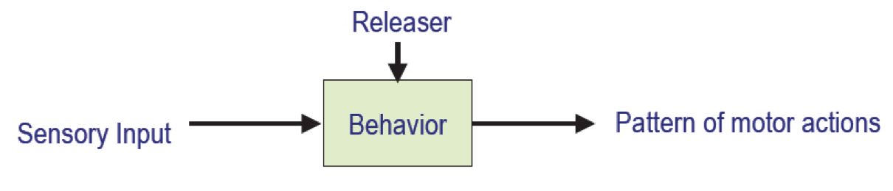

#### Releaser

- Similar to a latch or Boolean variable that has to be set by a stimulus

- Acts as a control signal to activate a behavior 

### Schema Theory

Way of expressing basic unit of activity

#### Schema:

**a generic template for how to do some activities**, consists of:

- Information on how to act and/or perceive (knowledge, data structures, models)

- Computational process by which it achieves the activity (algorithm)

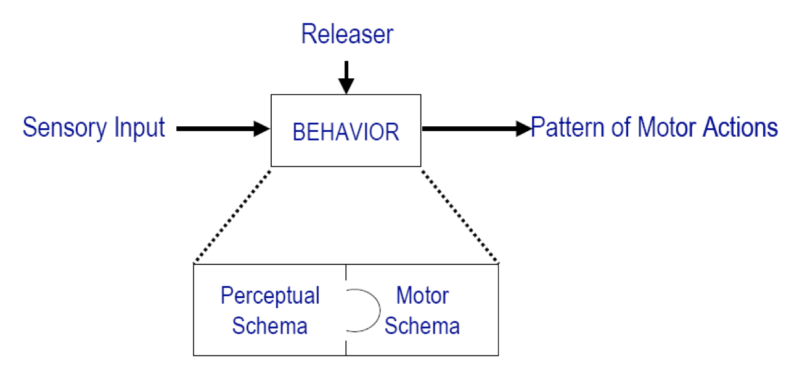

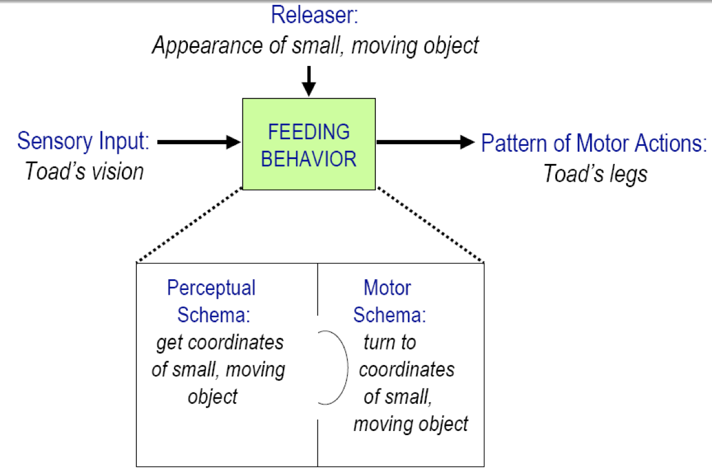

### Emergent Behaviour, why? 

emergence is a property of a collection of interacting components (here, behaviors)

#### Why

- Complexity of the world in which the robot resides
- Complexity of perceiving that world
- Complexity of interactions of agents and the world

### Behaviour Coordination Strategies

#### Competitive

- Fixed prioritization

  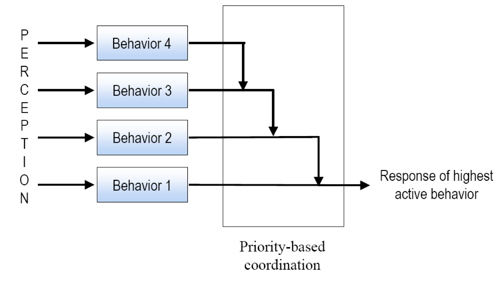

- Action selection

  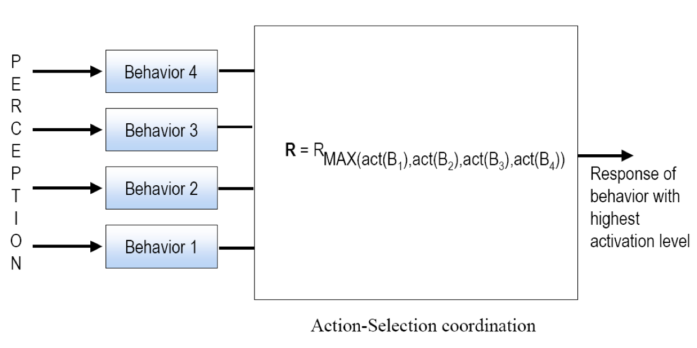

- Vote generation

  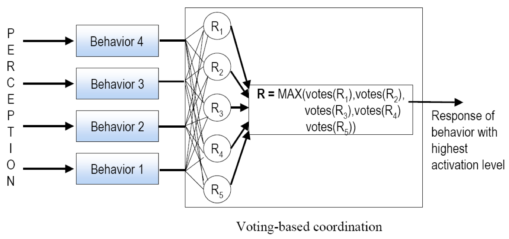

#### Cooperative

- Vector addition using potential fields

  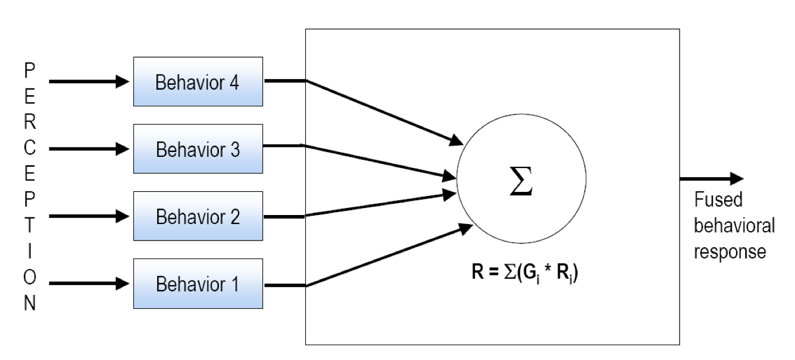

### Finite State Acceptor Diagrams

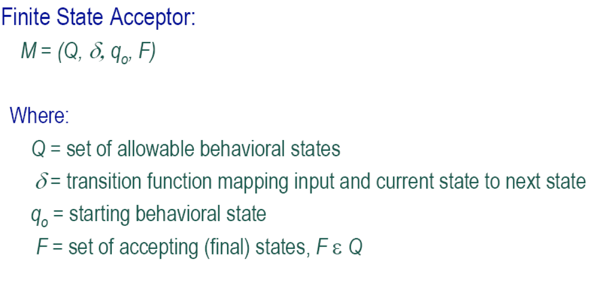

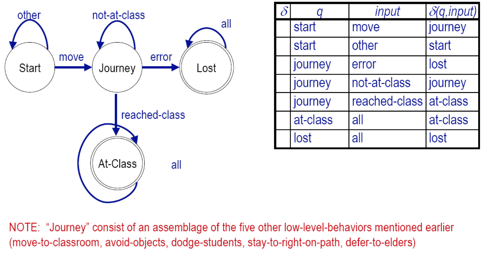

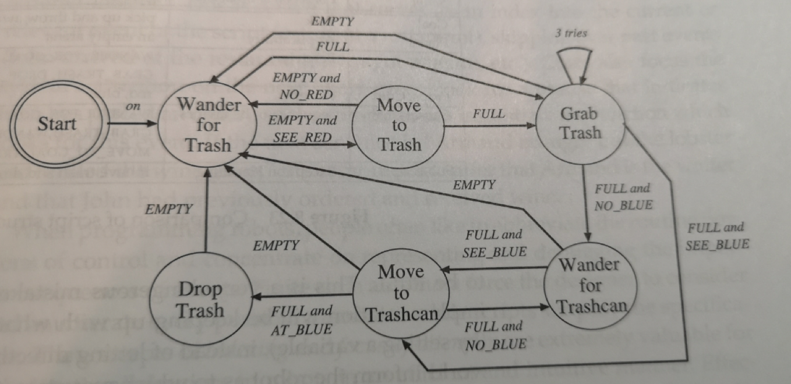

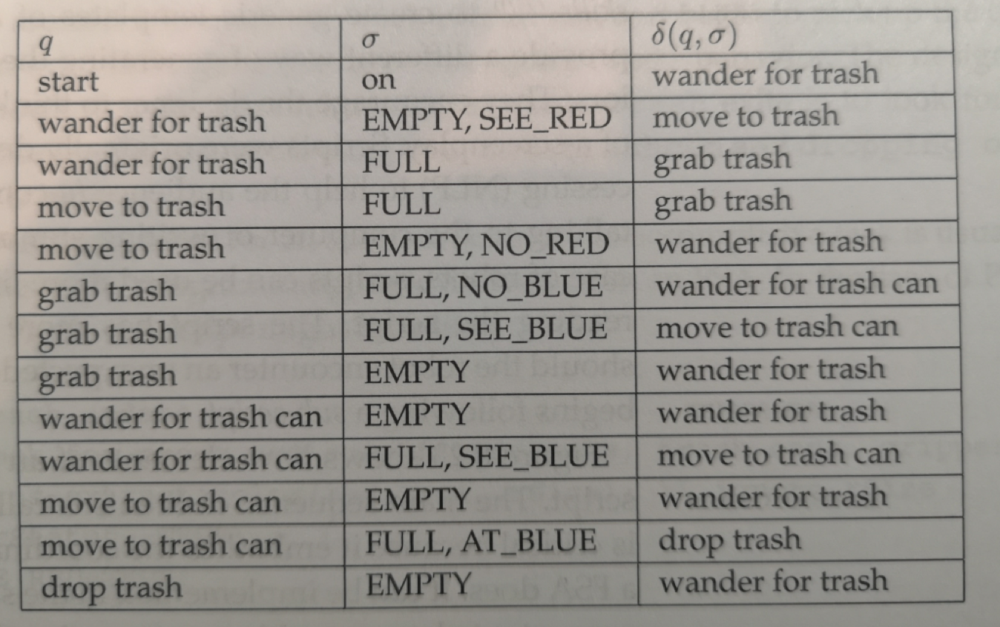

### Representative Reactive/Behavior-Based Architectures

#### Subsumption

Task: recycling coca-cola cans

Simplification:

- only coca-cola cans are red objects

- Only trash bin is blue object in the environment

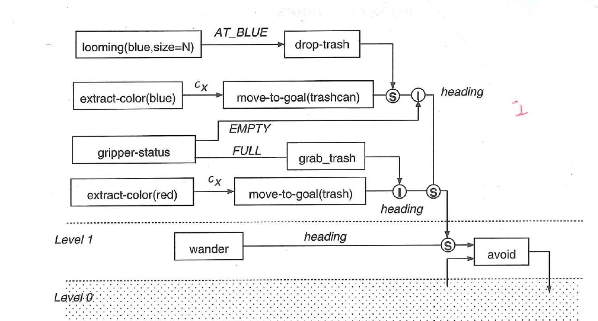

##### Strengths:

- Hardware retargetability: Subsumption can compile down directly onto programmable-array logic circuitry

- Support for parallelism: Each behavioral layer can run independently and asynchronously

##### Null (not strength/not weakness):

- Robustness: Can be successfully engineered into system but is often hard-wired and hard to implement

- Timeliness for development: Some support tools exist, but significant learning curve exists

##### Weaknesses:

- Run time flexibility: priority-based coordination mechanism, ad hoc aspect of behavior generation, and hard-wired aspects limit adaptation of system

- Support for modularity: behavioral reuse is not widely done in practice

#### Motor Schemas

•Potential field techniques, Common fields in behaviours

•Steps in Designing a Reactive Behavioural System

•How to represent a behaviour

© Zhihao DAI 2020

