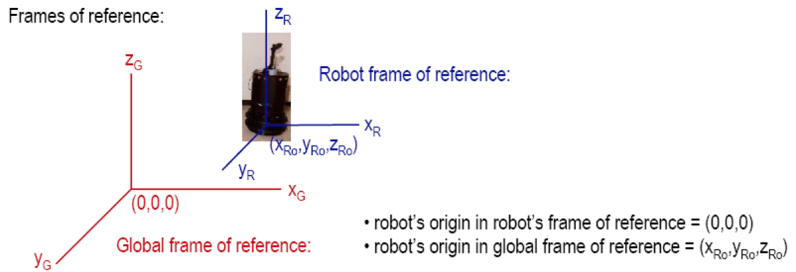

## Lecture 4: Sensing / Perception

### “New View” of Perception

Perception without the context of action is meaningless.

- Action-oriented perception

  Perceptual processing tuned to meet motor activities’ needs

- Expectation-based perception

  Knowledge of world can constrain interpretation of what is present in world

- Focus-of-attention methods

  Knowledge can constrain where things may appear in the world

- Active perception

  Agent can use motor control to enhance perceptual processing via sensor positioning

#### Consequence of “New View”

Purpose of perception is motor control, not representations

Multiple parallel processes that fit robot’s different behavioural needs are used

Highly specialized perceptual algorithms extract necessary information and no more.

**Perception is conducted on a “need-to-know” basis**

### Logical sensor:

- **Abstraction of sensors**

- **Unit of sensing or module that supplies a particular percept**
- Consists of: signal processing from physical sensor, plus software processing needed to extract the percept
- Can be easily implemented as a perceptual schema

### Multiple Sensor Combinations:

#### Redundant

Sensors return the same percept

- Physical redundancy
- Logical redundancy

#### Complementary

Sensors provide disjoint types of information about a percept

#### Coordinated

Use a sequence of sensors

Example: cue-ing or focus-of-attention; see motion, then activate more specialized sensor.

### Categorizing Perceptual Stimuli

- **Proprioception**: measurements of robot movement relative to the robot’s internal frame of reference 

- **Exteroception**: measurements of layout of the environment and objects relative to robot’s frame of reference

- **Exproprioception**: measurement of the position of the robot body or parts relative to the layout of the environment

### Major Categories of Sensors

#### Proprioceptive

Sensors that give information on the internal state of the robot.

Examples:

- Encoders

- Inertial navigation system (INS)

- Global positioning system (GPS)

- Compass

#### Proximity

Measure relative distance (range) between sensor and objects in environment

- Sonar (ultrasonics)

  - Foreshortening: (no solutions yet). 

    FOV 30, one side return back first, another side later (remember it is sound)

  - Cross-talk: sonar cannot tell if the signal it is receiving was generated by itself, or by another sonar in the ring
  - Specular reflection: when wave hits a surface at an acute and bounces away

- Infrared (IR

  Emit near-infrared energy and measure amount of IR light returned

  - Light can be “washed out” by bright ambient lighting

  - Light can be absorbed by dark materials

- Bump and feeler sensors

  Tactile (touch) sensors: wired so that when robot touches object, electrical signal is generated using a binary switch

#### Computer vision

- Cameras (produce images over same electromagnetic spectrum that humans see)

- Thermal sensors

- X-rays

- Laser range finders

- Synthetic aperature radar (SAR)

#### Mission-specific

### How do you rate sensors

- **Field of view, range**: does it cover the “right” area

- **Accuracy & repeatability**: how well does it work?

- **Responsiveness** in target domain: how well does it work for this domain?

- **Power consumption**: may suck the batteries dry too fast

- **Reliability**: can be a bit flakey, vulnerable

- **Size**: always a concern!
- **Computational Complexity**: can you process it fast enough?

- **Interpretation Reliability**: do you believe what it’s saying?

### Differences between LiDAR and RADAR?

- **RADAR uses radio waves** while **LiDAR uses light rays, the lasers** to be more precise.

- Size and the position of the object can be identified fairly by RADAR, while LiDAR can give accurate surface measurements.

- RADAR uses antennae for transmission and reception of the signals, while LiDAR uses CCD optics and lasers for transmission and reception.