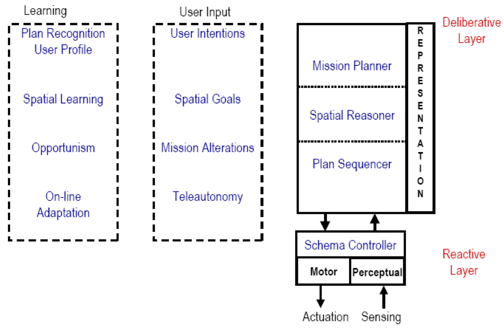

## Lecture 5: Hybrid Deliberative/Reactive Systems

### Why Hybridize?

- **Different time scale:** 

  Use of asynchronous processing techniques (multi-tasking, threads, etc) allow deliberative functions to execute independently of reactive behaviors

- **Good software modularity** 

  allows subsystems or objects in Hybrid architectures to be mixed and matched for specific applications

#### Limitations of purely reactive method

Collection of stimulus-response rules

- Good
  - Simple
  - Fast

- Bad
  - No memory
  - No internal representations  of the world
  - Unable to plan ahead
  - Unable to learn

- Remember the state of the robot/world

- Plan optimal trajectories

- Make maps

- Monitor its own performance

- Select best behaviors to accomplish a task

#### Limitations of purely deliberative method

The robot uses all the available sensory information and stored internal knowledge (world model) to create a plan of action: sense → plan → act (SPA) paradigm.

- Good:
  - Capable of learning and prediction
  - Finds strategic solutions

- Bad:
  - Planning requires search through potentially all possible plans, which takes a long time
  - Requires a world model, which may become outdated
  - Too slow for real-time response

### Common Components

- **Sequencer**: agent that generates set of behaviors to use in order to accomplish the subtask, and determines any sequences and activation conditions

- **Resource manager (Schema Controller)**: allocates resources to behaviors, including selecting from libraries of schemas (e.g., determining whether to use sonar or laser in a perceptual schema, depending upon the task)

- **Cartographer (Spatial Reasoner)**: responsible for creating, storing, and maintaining a map or spatial information, plus methods for accessing data. Contains global world model and knowledge representation.

- **Mission Planner**: interacts with human, operationalizes commands into robot terms, and constructs mission plan.

- **Performance monitoring**: allows robot to notice if it is making progress or not.

- **Problem solving agents (behaviours)**

### More Recent AuRA Architecture

Name one representative hybrid systems and the key components 

