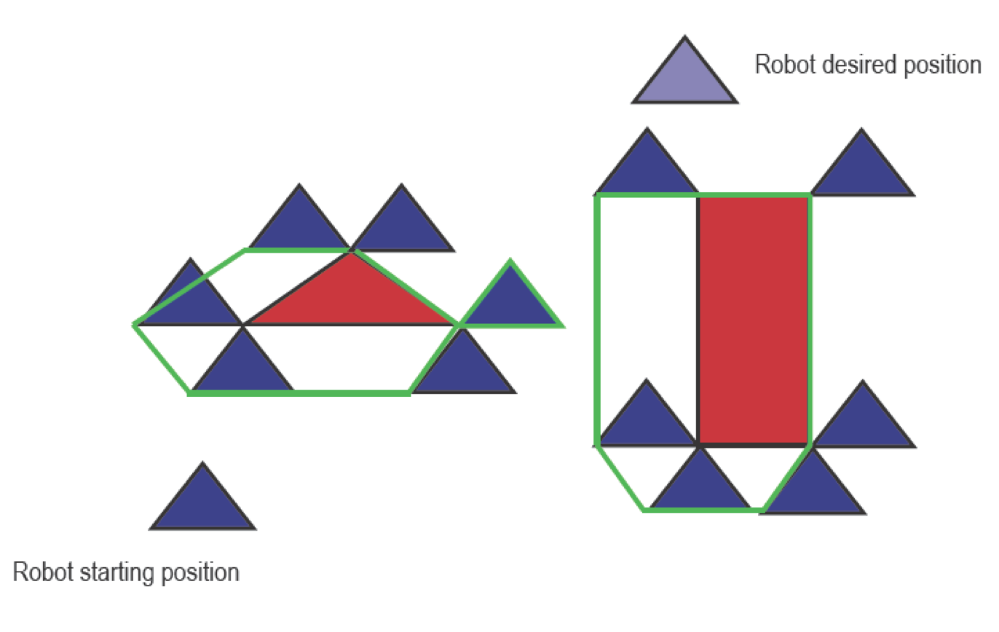
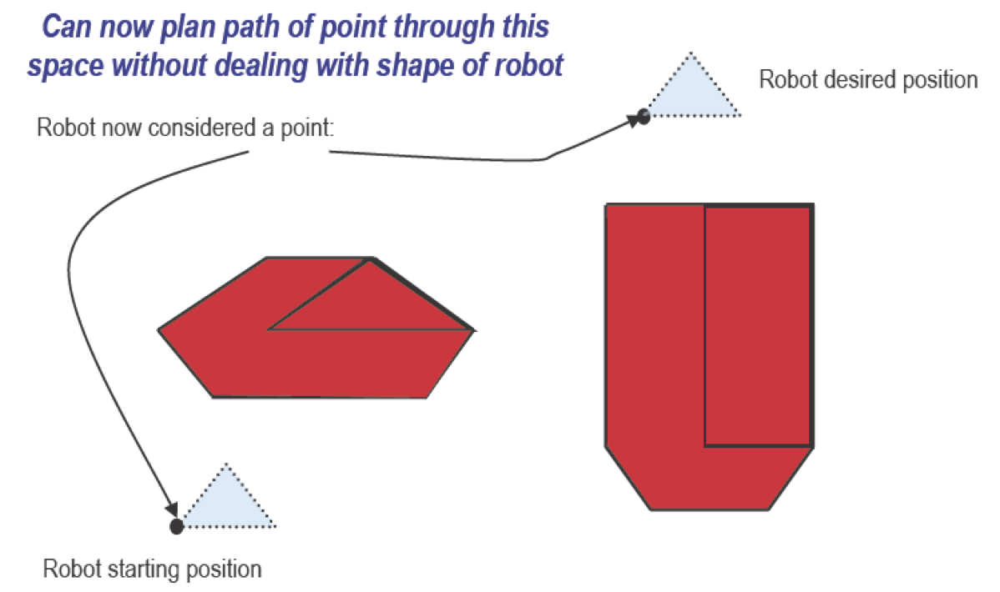
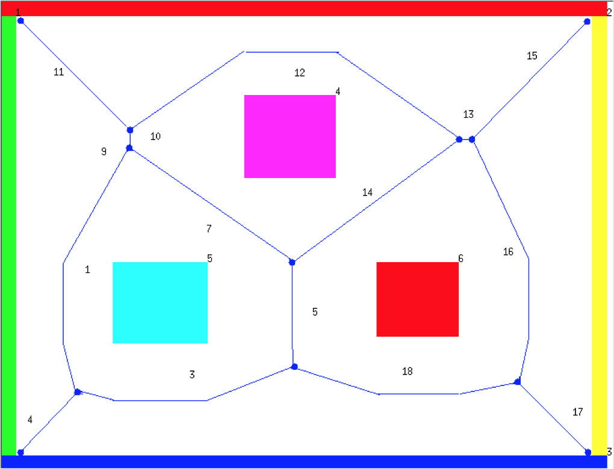
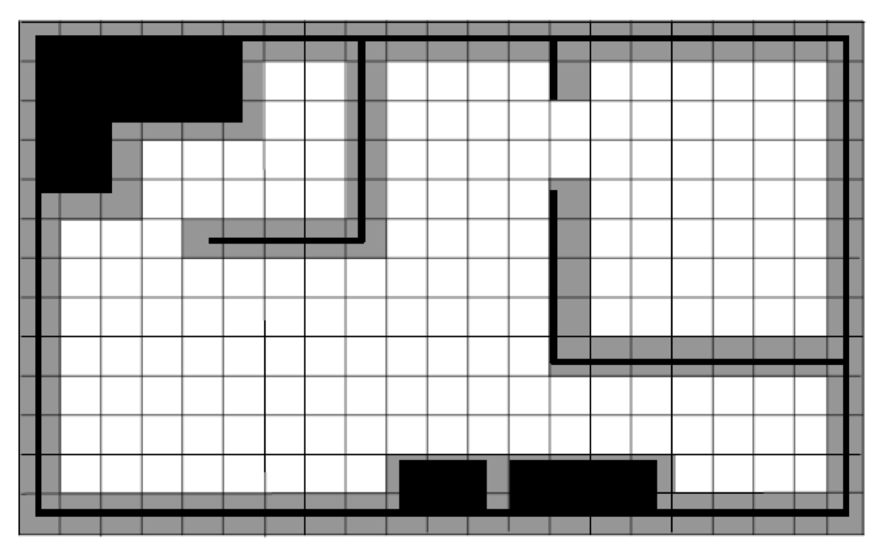
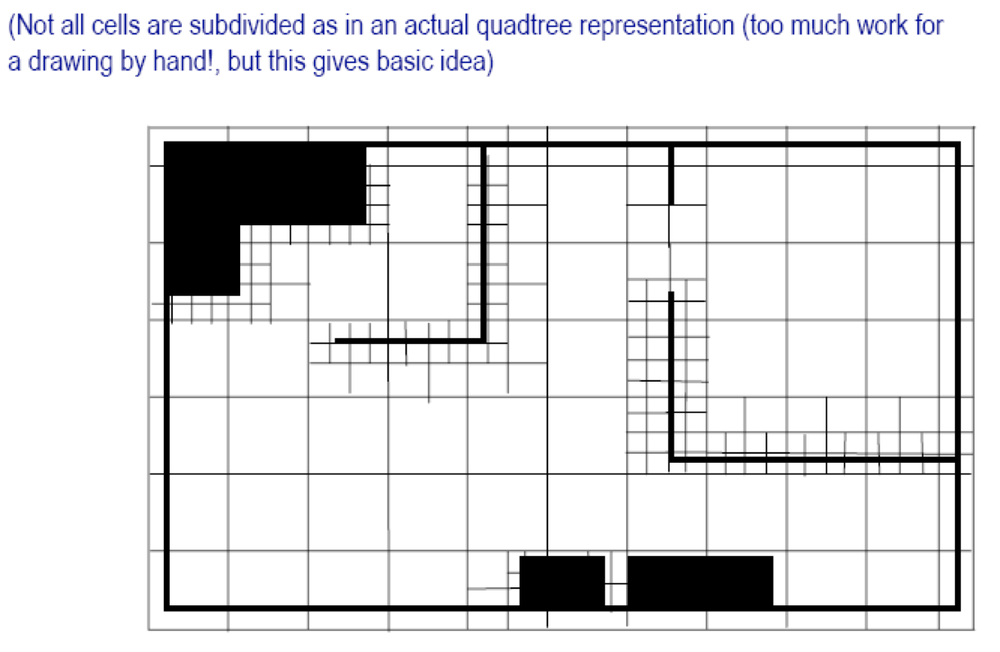
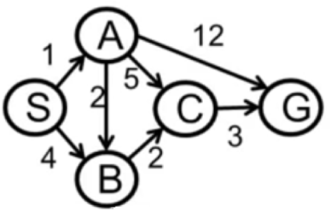
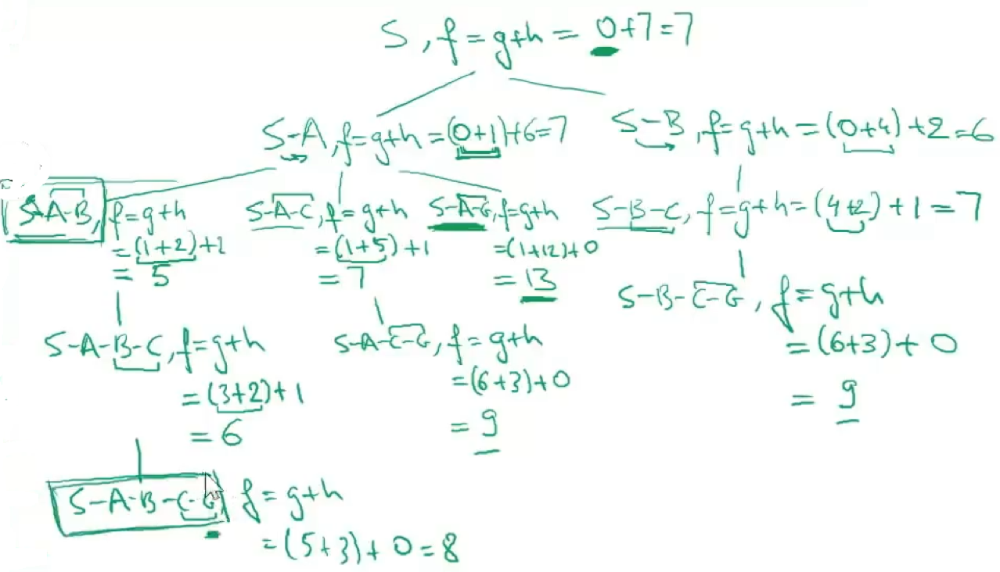
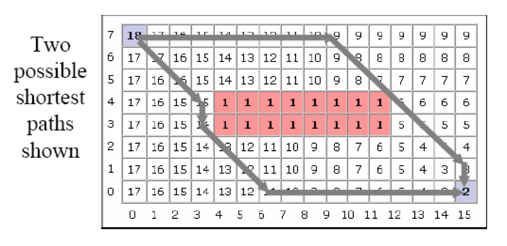

## Lecture 7: Metric Path Planning

### Configuration Space (CSpace)

> World Space: physical space robots and obstacles exist in.

Data structure that allows robot to specify position and orientation of objects and robot in the environment

### Object Growing

We can “grow” objects by the width of the robot and then consider the robot to be a point

Greatly simplifies path planning

New representation of objects typically called “configuration space object”

### CSpace representations 

- Generalized Voronoi Graphs (GVGs)

- Regular grids

- Quadtrees/octtrees

### Generalized Voronoi Graphs (GVGs)

- Generate a Voronoi edge, which is equidistant from all points

- Point where Voronoi edge meets is called a Voronoi vertex

Note: vertices often have physical correspondence to aspects of environment that can be sensed (e.g. staying equidistance from all obstacles)

If robot follows Voronoi edge, it won’t collide with any modeled obstaclesàdon’t need to grow obstacle boundaries

### Regular grids / occupancy grids

Superimposes a 2D Cartesian grid on the world space

If there is any object in the area contained by a grid element, that element is marked as occupied

Center of each element in grid becomes a node, leading to highly connected graph

Grids are either considered 4-connected or 8-connected

#### Disadvantages

- If object falls into even small portion of grid element, the whole element is marked as occupied

- Leads to wasted space
  - Solution: use fine-grained grids (4-6 inches)
  - But, this leads to high storage cost and high # nodes for path planner to consider

- Partial solution to wasted space: **Quadtrees**

### Quadtrees

Representation starts with large area (e.g., 8x8 inches)

If object falls into part of grid, but not all of grid, space is subdivided into four smaller grids

If object doesn’t fit into sub-element, continue recursive subdivision

3D version of Quadtree –called an **Octree**.

### A* Search Algorithm

Reduces number of paths to be explored

No need to explore a path if it cannot be a good path

Estimates *h*(*n*), even if no actual path available

- $h(n)$, Cheapest cost of getting from node n to goal

Use this estimate to prune out paths that cannot be good

#### A* Evaluation function:

$f^*(n) = g^*(n) + h^*(n)$

where $*$ means these are estimates.

$g^*(n)$ is the cost of getting to node n from start

In path planning, $g^*(n)$ is equivalent to $g(n)$.

#### Estimating $h(n)$

Must ensure that $h^*(n)$ is never greater than $h(n)$. 

Admissibility condition:

- Must always underestimate remaining cost to reach goal

Easy way to estimate:

- Use Euclidian (straight line) distance

- Straight line will always be shortest path

- Actual path may be longer, but admissibility condition still holds

| **State** | $H^*$ |
| --------- | ----- |
| S         | 7     |
| A         | 6     |
| B         | 2     |
| C         | 1     |
| G         | 0     |

#### Advantage:

Can be used with any Cspace representation that can be transformed into a graph

#### Limitation:

Hard to use for path planning when there are factors to consider other than distance (e.g., rocky terrain, sand, etc.) (*Bellman-Ford types of* algorithms deal with this situation)

#### Difference with Dijkstra's Algorithm

A* uses cost from start node to the current node and the cost from current node to the future node estimated by a heuristic; while Dijkstra's algorithm only considers the cost from the start node to the current node

A* will generally use less memory

You must know the entire search space to use Dijkstra's algorithm.

### Wavefront-Based Path Planners

Well-suited for grid representations

General idea: consider Cspace to be conductive material with heat radiating out from initial node to goal node

If there is a path, heat will eventually reach goal node

Nice side effect: optimal path from all grid elements to the goal can be computed

