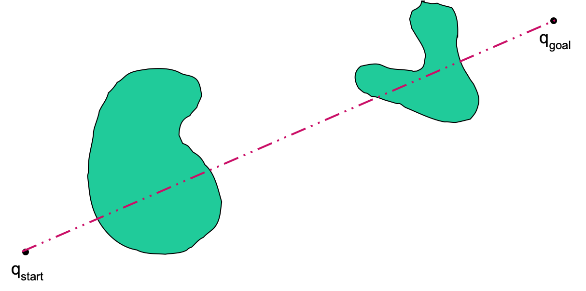

## Lecture 8: Path Planning Based on Bug Algorithms

The motion planning based on bug algorithms is closely related to reactive behaviours: moving to goal and boundary following.

- Simple and intuitive

- Straightforward to implement

- Success guaranteed (when possible)

- Assumes perfect positioning and sensing 

- Sensor based planning – has to be incremental and reactive

### Bug-0 Algorithm

1. head toward goal

2. If encounter obstacles, follow the obstacles until you can head toward the goal again

3. continue

However, it's not guaranteed to work.

### Bug-1 Algorithm

1. head toward goal
2. if an obstacle is encountered, circumnavigate it and remember how close you get to the goal
3. return to that closest point (by the shortest wall following path) and continue

#### Analysis

$D = $ straight-line distance

$P_i = $ perimeter of the $i$-th obstacle 

Lower bound: $D$.

Upper bound: $D + 1.5 \sum_i{P_i}$.

### Bug-2 Algorithm

1. head toward goal on the m*-line*

2. if an obstacle is in the way, follow it until encountering the m-line again *closer to the goal* (the new leave point is closer to the goal than previous ones)

3. Leave the obstacle and continue toward the goal, i.e., with step 1 ...

#### Analysis

$D = $ straight-line distance

$P_i = $ perimeter of the $i$-th obstacle 

$N_i =$ number of m-line intersections with the $i$-th obstacle.

Lower bound: $D$.

Upper bound: $D + 0.5 \sum_i{N_i}{P_i}$.

### Bug1 vs. Bug2

#### Bug1

- *Exhaustive search*

- Optimal leave point

- Performs better with complex obstacles

#### Bug 2

- *Opportunistic (greedy) search*

- Performs better with simple obstacles

### Summary

Bug 0: basic principle, not practical

Bug 1: safe and reliable

Bug 2: better in some cases; worse in others

#### Assume robot is modelled as a point---why can we do this ?

Object growing.

