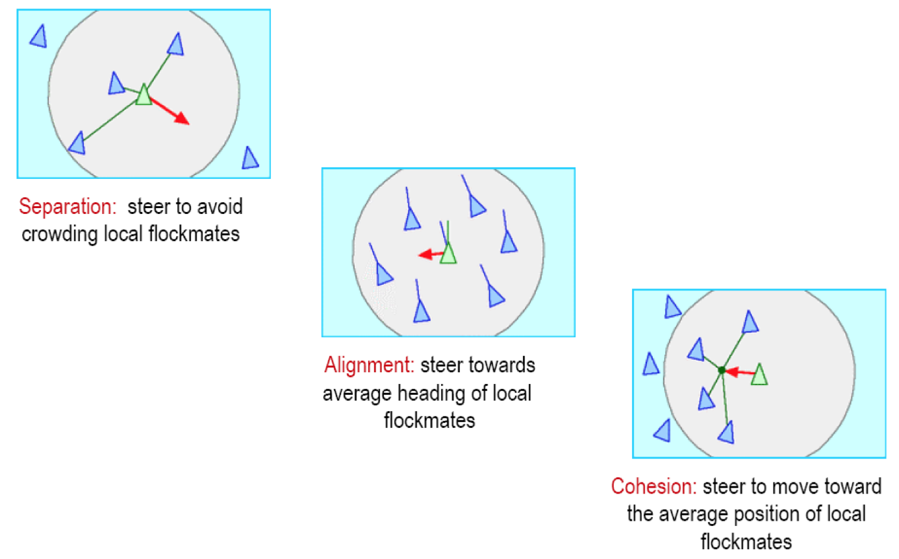

## Lecture 9: Multi-Robot Systems

### Motivations

- Task is too complex for one robot

- Task is inherently distributed
  - Ex. soccer (goalie, striker, defenders…)

- Several resource-bound robots are cheaper (or more feasible to build) or faster than a single, more capable robot
  - Ex. demining or other coverage tasks

- Multiple robots are more robust because they offer redundancy
  - Ex. one fails, others take its place; **graceful degradation**

### Negative Aspects of Teaming

- Interference

- Communication cost and robustness

- Uncertainty concerning other robots’ intentions

- Overall system cost

### Swarm intelligence

a property of systems of non-intelligent robots exhibiting collectively intelligent behavior.

### Multi-Robot Communication

Objective of communication: Enable robots to exchange state and environmental information with a minimum bandwidth requirement

Proper approach to communication dependent upon application

### Types

- Implicit vs. Explicit
- Local vs. Global

### Motion Coordination

- Relative to other robots:
  - E.g., formations, flocking, aggregation, dispersion…

- Relative to the environment:
  - E.g., search, foraging, coverage, exploration …
- Relative to external agents:
  - E.g., pursuit, predator-prey, target tracking …

- Relative to other robots and the environment:
  - E.g., containment, perimeter search …

- Relative to other robots, external agents, and the environment:
  - E.g., evasion, soccer …

Following / Swarming / Flocking / Schooling

#### Boids: generic simulated creatures.

Simulated boid flock avoiding cylindrical obstacles

### Nerd Herd Approach

Fundamental principle: Define basis behaviours as general building blocks for synthesizing group behaviour

Set of basis behaviours proposed:

- Avoidance
- Safe-wandering
- Following
- Aggregation
- Dispersion
- Homing

Combine basis behaviours into higher-level group behaviours:

- Flocking
- Foraging

