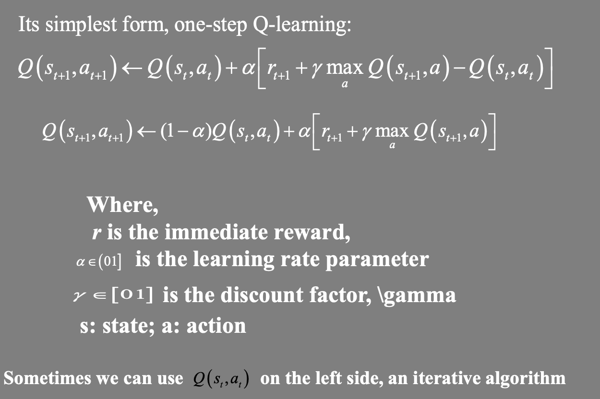
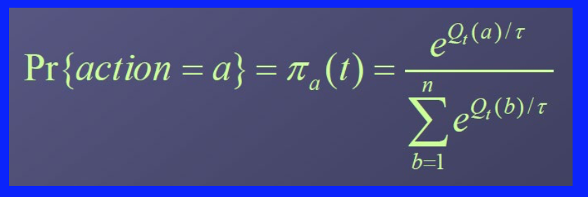
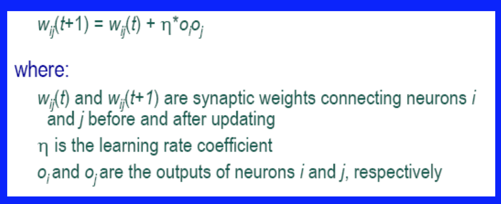
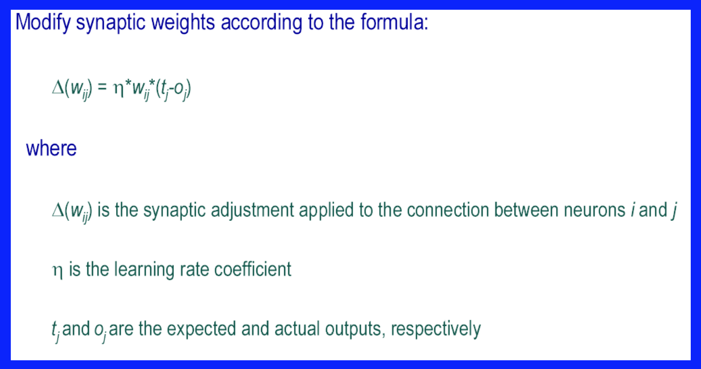
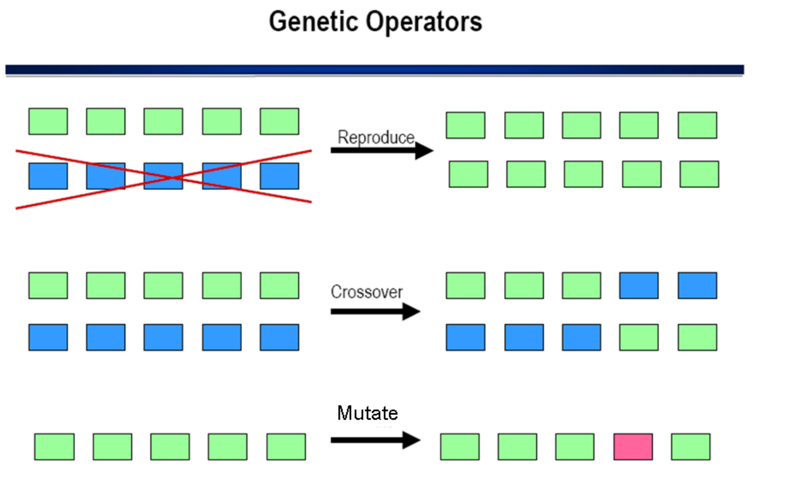
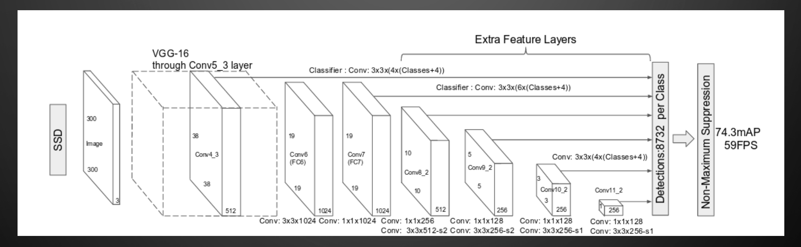

## Lecture 10: Robot Learning

### Why do robots need to learn?

- Reduce complexity of robot design
- Allow robots to dynamically adapt performance over time

Learning produces changes within an agent that over time enable it to perform more effectively within its environment.

### Representative Learning Approaches

- Reinforcement learning
- Neural networks
- Evolutionary learning
- PSO

### Reinforcement Learning

#### Elements

- A policy
  - A map from state space to action space
- A reward function
  - Maps each state (or, state-action pair) to a real number, called reward.
- A value
  - Value of a state (or, state-action pair) is the total expected reward.

#### Q-Learning Algorithm

Q-learning, two action selection methods, understand the calculation process of one step Q-learning, 

##### One-Step Q-Learning

#### $\epsilon$-Greedy Action Selection

Greedy action selection:

$a_t = a_t^* = argmax_{a} Q_t(a)$

$\epsilon$-Greedy
$$
a_t = 
\begin{cases}
a_t^* \text{ with probability } 1-\epsilon \\
\text{random action with probability } \epsilon
\end{cases}
$$
where $\epsilon$ is usually a small number.

The simplest way to try to balance **exploration and exploitation**.

#### Softmax Action Selection

Rank the alternatives.

- Generate a probability density/mass function to estimate the rewards from each action

- All actions are ranked/weighted

- Typically use Boltzmann distribution, i.e. choose action *a* on iteration *t* with probability

### Learning rules

#### Hebbian learning

When two connected neurons are simultaneously active, the synaptic weight of their connection is strengthened.

In other words, neurons that fire together wire together.

#### Delta Learning (Least Mean Squares, LMS)

### Genetic Algorithms (GA)

- Population’s best members are rewarded according to their fitness
- Poorly performing individuals are punished or deleted from the population

- Over generations, the population improves the quality of its set of solutions

GAs are not guaranteed to yield an optimal global solution, they generally produce high-quality solutions within reasonable amounts of time for certain problem spaces (including learning of control strategies for behavior-based robots)

- Reproduction

- Crossover 
- Mutation

### Particle Swarm Optimization (PSO)

- Each particle is searching for the optimum.
- Each particle is *moving* and hence has a *velocity*.
- Each particle remembers the position it was in where it had its best result so far (its *personal best*).

– *The adjustment to velocity is essentially like this:*

- *The current velocity PLUS*

- *A weighted random portion in the direction of its personal best PLUS*

- *A weighted random portion in the direction of the neighbourhood best.*

### Single Short MultiBox Detector (SSD)

### Cognitive robotics

Cognitive robotics studies robots with intelligent behavior by providing it with a processing architecture that will allow it to learn and reason about how to behave in response to complex goals in a complex world.